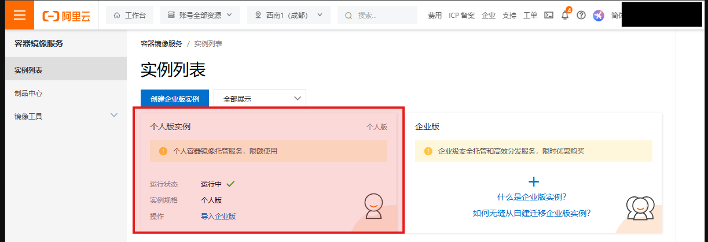
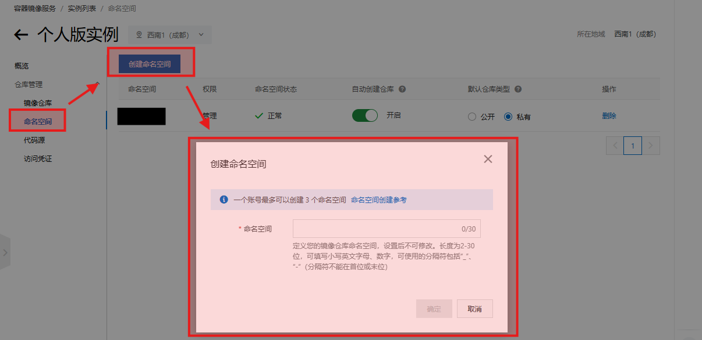
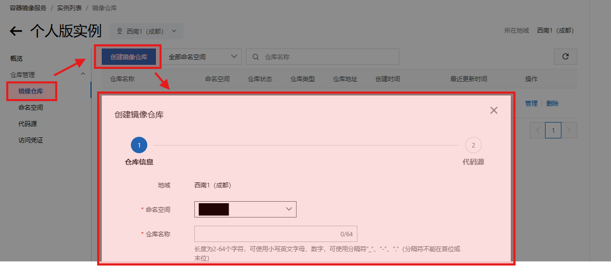
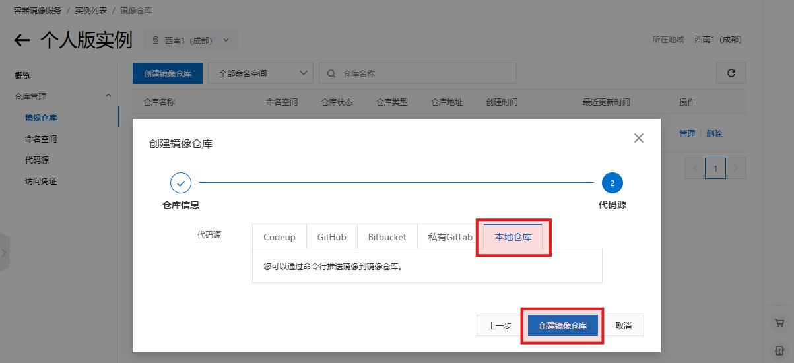
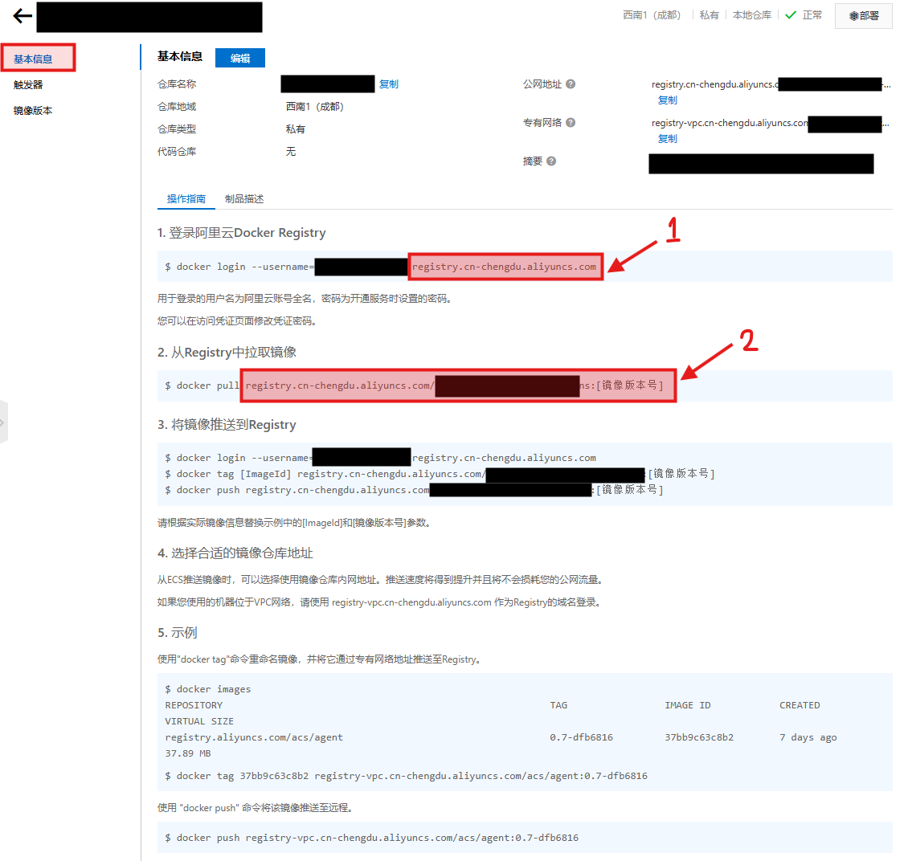
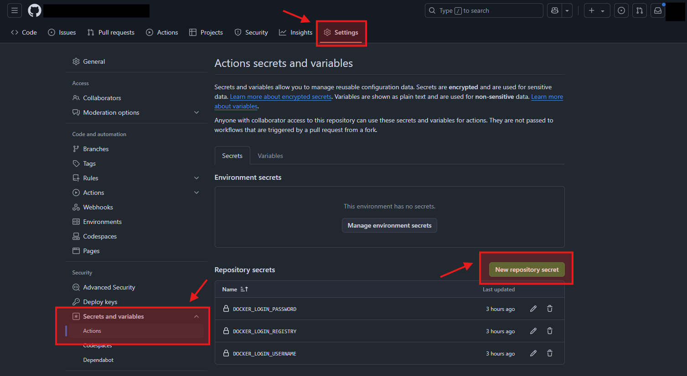
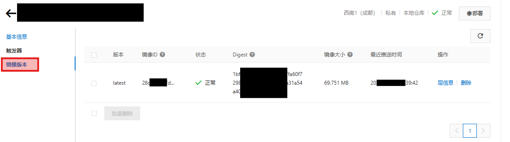

# learn-github-actions

## 部署流程

首先通过 GitHub Actions 实现在 push 到 main 分支时，生成一个 docker 镜像，并上传到阿里云的容器镜像服务（之后简称 ACR）。然后通过 ACR 的触发器将镜像更新信息报告给服务器，服务器拉去最新镜像并部署。

## 创建阿里云容器镜像仓库

登录到容器镜像服务面板 https://cr.console.aliyun.com

点击个人版实例，



创建命名空间，



创建镜像仓库，



并在下一步的代码源中选择本地仓库，



进入刚刚创建的仓库，查看基本信息，



标记为1的是仓库的登录地址，标记为2的是镜像的tags，注意它是完整的 `<hostname>/<namepsace>/<image>:<version>` 的格式。

## 创建并配置 GitHub Actions

在 git repo 根目录下创建 `.github/workflows/xxx.yaml` 文件，并写入：

```yaml
name: CI

on:
  push:
    branches: [ "main" ]
  pull_request:
    branches: [ "main" ]

  # Allows you to run this workflow manually from the Actions tab
  workflow_dispatch:

jobs:
  # This workflow contains a single job called "build"
  build:
    # The type of runner that the job will run on
    runs-on: ubuntu-latest

    # Steps represent a sequence of tasks that will be executed as part of the job
    steps:
      # Checks-out your repository under $GITHUB_WORKSPACE, so your job can access it
      - uses: actions/checkout@v4

      # https://pnpm.io/continuous-integration#github-actions
      - name: 安装 pnpm
        # https://github.com/pnpm/action-setup
        uses: pnpm/action-setup@v4

      - name: 安装 Node.js
        # https://github.com/actions/setup-node
        uses: actions/setup-node@v4
        with:
          # https://github.com/nodejs/Release/blob/main/CODENAMES.md
          node-version: lts/Jod
          cache: 'pnpm'
      
      - name: 安装依赖
        run: pnpm install

      - name: 打包构建
        # https://docs.github.com/en/actions/writing-workflows/workflow-syntax-for-github-actions#jobsjob_idstepsworking-directory
        working-directory: ./src
        run: pnpm run build

      # https://cr.console.aliyun.com/
      - name: 登录到阿里云容器镜像服务
        # https://github.com/docker/login-action
        uses: docker/login-action@v3
        with:
          registry: registry.xxxx.aliyuncs.com
          username: ${{ secrets.DOCKER_LOGIN_USERNAME }}
          password: ${{ secrets.DOCKER_LOGIN_PASSWORD }}
      
      - name: 构建 Docker 镜像并上传到阿里云容器镜像服务
        # https://github.com/docker/build-push-action
        uses: docker/build-push-action@v6
        with:
          # By default, this action uses the Git context to check out the repository,
          # but we dont want that, so use Path context instead.
          # https://github.com/docker/build-push-action?tab=readme-ov-file#path-context
          context: .
          file: ./Dockerfile
          push: true
          # https://sundaysto.club/archives/li-yong-github-actions-he-aliyun-si-you-jing-xiang-ku-shi-yong-dockerbu-shu-nodejs-xiang-mu
          tags: registry.xxxx.aliyuncs.com/xxxx/xxxx:latest
```

注意到上面有几项需要根据具体情况修改：

- `registry: registry.xxxx.aliyuncs.com`: 阿里云容器镜像服务登录地址。
- `username: ${{ secrets.DOCKER_LOGIN_USERNAME }}`: 用户名，就是登录阿里云的用户名。
- `password: ${{ secrets.DOCKER_LOGIN_PASSWORD }}`: 密码，在访问凭证/获取凭证设置。
- `tags: registry.xxxx.aliyuncs.com/xxxx/xxxx:latest`: 仓库名，在镜像仓库/基本信息中查看，格式一般为 `<hostname>/<namepsace>/<image>:<version>`。




将修改 git push 到 main 分支以后，GitHub Actions 就运行起来了，如果所有步骤都成功，则会出现在阿里云仓库镜像版本中。


